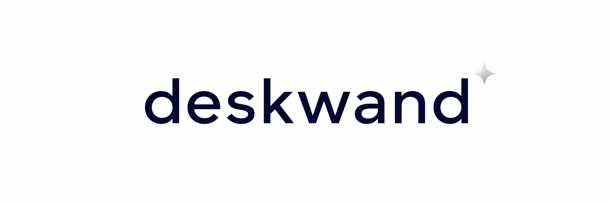

<p align="center">
  
</p>

<h1 align="center">DeskWand</h1>
<p align="center"><strong>The open source AI desktop agent.</strong></p>

<p align="center">
  <a href="https://deskwand.com">Website</a> ·
  <a href="https://deskwand.com/#download">Download</a> ·
  <a href="https://github.com/deskwand/agent/releases">Releases</a>
</p>

<p align="center">
  
  
</p>

<p align="center">
  <a href="./README_zh.md">中文</a>
</p>

---

## What is DeskWand

DeskWand is a desktop AI agent built on the Pi Agent SDK.

Unlike a chatbot, DeskWand understands goals, plans tasks, uses tools, delegates work to subagents, and executes complex tasks on your computer. It learns from successful tasks and turns them into reusable skills, so it gets better over time.

---

## Features

**Goal-driven agents.** Give it a goal and the agent plans and executes.

**Subagents.** Break complex tasks into specialized agents that work in parallel.

**Web search and tools.** Search works out of the box, no setup needed.

**Desktop native.** Work with your local files, projects, and environment.

**Agent-native Office.** Ask for a report, a spreadsheet, or a deck — the agent writes the real Word, Excel, or PowerPoint file.

**Self-improving skills.** Successful tasks can become reusable skills.

**Multi-model support.** Use the AI models that work best for you.

**Usage and estimated cost.** Just this machine, priced from a public price table — by model, day, and currency.

**Standalone vision model.** Set a separate vision model so non-multimodal models like DeepSeek can read images too.

**Pi extensions & marketplace.** Run Pi CLI extensions and install plugins, skills, and prompts from the built-in package marketplace.

**Messaging channels.** Reach your agent from Telegram, Discord, QQ, Slack, WeChat, or Feishu.

---

## Built with Pi Agent SDK

DeskWand is built on the Pi Agent SDK, an open-source agent framework. Pi provides the agent foundation; DeskWand adds the desktop product layer: goal execution, subagent orchestration, tools, web capabilities, and skill learning.

---

## How it works

```
    Your Goal
        |
    Agent Planning
        |
    Subagents + Tools
        |
    Task Execution
        |
    New Skill Learned
        |
    Better Future Tasks
```

---

## See DeskWand in action

<table>
  <tr>
    <td width="50%" align="center">
      <a href="https://file.deskwand.com/media/demos/meeting-minutes.mp4"></a><br>
      <strong>Meeting notes → Word document</strong>
    </td>
    <td width="50%" align="center">
      <a href="https://file.deskwand.com/media/demos/web-research.mp4"></a><br>
      <strong>Web research → Executive brief</strong>
    </td>
  </tr>
  <tr>
    <td width="50%" align="center">
      <a href="https://file.deskwand.com/media/demos/excel-analysis.mp4"></a><br>
      <strong>Excel analysis → Report with charts</strong>
    </td>
    <td width="50%" align="center">
      <a href="https://file.deskwand.com/media/demos/code-fix.mp4"></a><br>
      <strong>Bug report → Passing tests</strong>
    </td>
  </tr>
</table>

---

### Installation

| Platform | Download |
|----------|----------|
| macOS | [`.dmg`](https://github.com/deskwand/agent/releases) |
| Windows | [`.exe`](https://github.com/deskwand/agent/releases) |
| Linux | [`.AppImage`](https://github.com/deskwand/agent/releases) · [`.deb`](https://github.com/deskwand/agent/releases) |

[deskwand.com/#download](https://deskwand.com/#download)

### Quick start

1. Download and install
2. Add your API key
3. Choose a model
4. Set a goal, and DeskWand plans, executes, and auto-continues

### Documentation

- [User Manual](https://www.deskwand.com/manual): the complete guide, from getting started to advanced features
- [Source](https://github.com/deskwand/agent): configuration, models, skills, MCP, and more

<p align="center">
  <a href="https://deskwand.com">deskwand.com</a>
</p>
